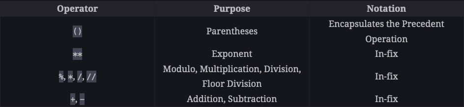
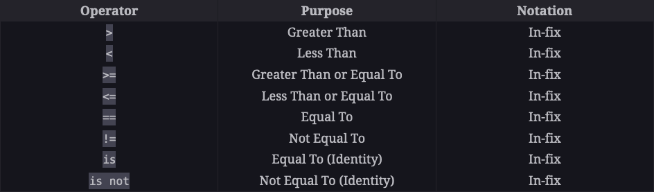
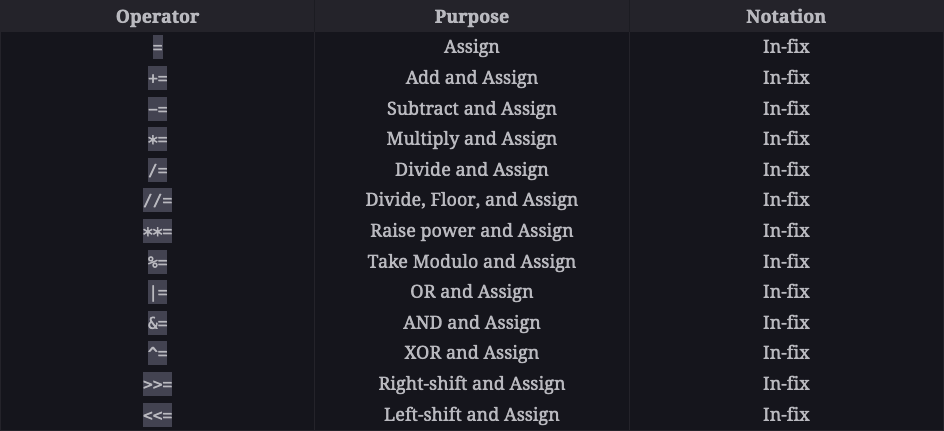
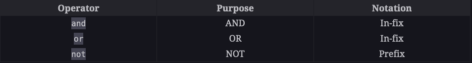
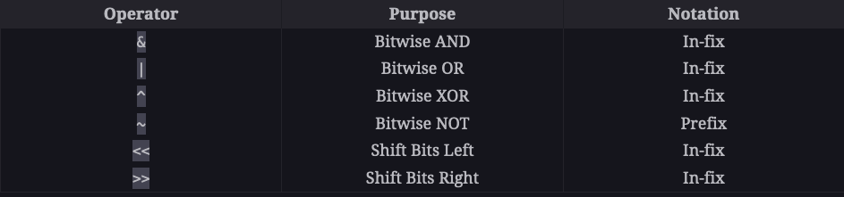

# Python Stuff

## Python Fundamentals

### Python Data Types

There are three data types in Python:

- Numbers
- Strings
- Booleans

This makes it a lot simpler to work with data in Python.

### Variables

Variables are used to store values. A variable is created the moment you first assign a value to it.

#### Naming rules for variables

- A variable name must start with a letter or the underscore character
- A variable name cannot start with a number, but numbers can be included in the rest of the name
- A variable name can only contain alpha-numeric characters and underscores (A-z, 0-9, and \_ )
- Variable names are case-sensitive (age, Age and AGE are three different variables)
- A variable name cannot contain spaces
- Variable names should be descriptive (age is better than a)

### Numbers

Python has three numeric types:

- int (signed integers)
- float (floating point real values) (aka decimal numbers), can be positive or negative
- complex (complex numbers)

#### Integers

Integers are whole numbers. They can be positive or negative, but they cannot be decimals.

#### Floats

Floats are real numbers. They can be positive or negative, and they can be decimals.
Floating-point numbers, or floats, refer to positive and negative decimal numbers. Python allows us to create decimals up to a very high decimal place. This ensures accurate computations for precise values.
A float occupies 24 bytes of memory.

#### Complex Numbers

Complex numbers are numbers with a real and imaginary part. The imaginary part is written with a "j"

> ## Imaginary Numbers
>
> Imaginary numbers are numbers that, when squared, have a negative result. The imaginary unit \( i \) is defined as \( \sqrt{-1} \). Imaginary numbers are then numbers that can be written as \( a + bi \), where \( a \) and \( b \) are real numbers and \( i \) is the imaginary unit. Complex numbers are a broader category that includes both real and imaginary numbers and can also be written in the form \( a + bi \).
>
> ### Uses of Imaginary Numbers
>
> 1.  **Electrical Engineering:** Imaginary numbers are used to represent alternating current and voltage in electrical engineering. They make it easier to analyze and understand electrical systems.
>
> 2.  **Control Theory:** In systems and control theory, the use of complex numbers and imaginary units is standard for analyzing system stability.
>
> 3.  **Quantum Mechanics:** Complex numbers, including imaginary numbers, are used to describe the state of quantum systems.
>
> 4.  **Signal Processing:** The Fourier Transform, a cornerstone of signal processing, uses imaginary numbers to transform a signal into its constituent frequencies.
>
> 5.  **Fluid Dynamics:** Complex analysis methods are used in potential flow theory, a subfield of fluid dynamics.
>
> 6.  **Economics:** In some cases, complex numbers have been used to model certain economic conditions or markets.
>
> 7.  **Mathematics:** Imaginary numbers are used in various areas of mathematics, including number theory and certain kinds of equations that cannot be solved using only real numbers.
>
> 8.  **Computer Graphics:** They can be used to perform rotations in 2D space.
>
> 9.  **Data Science:** Techniques like Singular Value Decomposition in machine learning can involve complex numbers, although the imaginary parts are usually discarded in the end.
>
> 10. **Telecommunications:** In designing and understanding systems like radio transmission, imaginary numbers can play a crucial role.
>
> So, even though imaginary numbers may sound "imaginary" or unrealistic, they have a wide range of very practical applications.

Here are some examples of complex numbers used in
python:

```python
>>> print(complex(10, 20))
(10+20j)
>>> print(complex(2.5, -18.2))
(2.5-18.2j)
>>> complex_1 = complex(0, 2)
>>> complex_2 = complex(2, 0)
>>> print(complex_1)
2j
>>> print(complex_2)
(2+0j)
```

Complex numbers are usually denoted as `i` in mathematics, but in Python, we use `j` to represent the imaginary part of the complex number, following the electrical en
gineering convention.

### Booleans

    The Boolean (also known as bool) data type allows us to choose between two values: true and false.

```python
>>> print(True)
True
>>> f_bool = False
>>> print(f_bool)
False
>>> type(f_bool)
<class 'bool'>
```

### Strings

Strings are used in Python to record text information, such as names. Strings in Python are actually a sequence, which basically means Python keeps track of every element in the string as a sequence. For example, Python understands the string `"hello'` to be a sequence of letters in a specific order. This means we will be able to use indexing to grab particular letters (like the first letter, or the last letter).

```python
>>> newString = "Wanda"
>>> print(newString[0])
W
>>> print(newString[-1])
a
```

```python
batman = "Bruce Wayne"
print(batman[-1])  # Corresponds to batman[10]
print(batman[-5])  # Corresponds to batman[6]

```

#### Length of a String

We can check the length of a string using the `len()` function.

```python
>>> len(newString)
5
```

#### string immutability

Strings are immutable, which means you cannot change an existing string. The best you can do is create a new string from the existing one.

```python
>>> subString = newString[1:3]
>>> print(subString)
an
```

You can't reassign a letter in string. You have to make a new variable.

Assigning a new value to a string variable will overwrite the previous value. The identity will change but not the value.

```python
>>> print(id(str1))
4334439920
>>> str1 = "bye"
>>> print(id(str1))
4334439984
>>>
```

### ASCII vs. Unicode

In Python3, all strings are sequences of Unicode characters. Unicode is a standard that defines a unique number for an **abstract** character. It is an international encoding standard for use with different languages and scripts, by which each letter, digit, or symbol is assigned a unique numeric value that applies across different platforms and programs.

### # String Slicing

Slicing is the process of obtaining a portion of a string by using it's indices.

You can slice with two indices, separated by a colon. The first index is the start index, and the second index is the end index. The end index is not included in the slice.

You can also slice with a step, which specifies how many characters you want to move forward after the first character is retrieved from the string.

Here's the syntax: `string[start:end:step]`

```python
>>> str1 = "Hello World"
>>> str1[0:5]
'Hello'
>>> str1[6:]
'World'
>>> str1[0:5:2]
'Hlo'
>>> str1[0:5:3]
'Hl'
>>> str1[0:5:4]
'Ho'
>>> str1[0:5:5]
'H'
>>> str1[0:5:6]
'H'
```

Essentially, you define when you start, stop and how many elements you skip. This also works for lists, too.

```python
# Start from index 0, stop at index 12, and step by 2
sliced_string = my_string[0:12:2]
print(sliced_string)  # Output: "Hlo ol"

```

Reversing a string using slicing

```python
my_string = "Hello, World!"
reversed_string = my_string[::-1]
print(reversed_string)  # Output: "!dlroW ,olleH"
```

#### Partial Slicing

```python
>>> my_string = "What the heck is going on here!?"
>>> print(my_string[:8])
What the
>>> print(my_string[8:])
 heck is going on here!?
>>> print(my_string[:])
What the heck is going on here!?
>>> print(my_string[::-1])
?!ereh no gniog si kceh eht tahW
```

## Python Operators

### Arithmetic Operators



#### Addition

```python
print(10 + 5)

float1 = 13.65
float2 = 3.40
print(float1 + float2)

num = 20
flt = 10.5
print(num + flt)

```

#### Subtraction

```python
>>> print(10 - 5)
5
>>>
>>> float1 = -18.678
>>> float2 = 3.55
>>> print(float1 - float2)
-22.228
>>>
>>> num = 20
>>> flt = 10.5
>>> print(num - flt)
9.5
```

#### Multiplication

```python
>>> print(40 * 10)
400
>>>
>>> float1 = 5.5
>>> float2 = 4.5
>>> print(float1 * float2)
24.75
>>>
>>> print(10.2 * 3)
30.599999999999998
```

#### Division

```python
>>> print(40 / 10)
4.0
>>>
>>> float1 = 5.5
>>> float2 = 4.5
>>> print(float1 / float2)
1.2222222222222223
>>> print(12.4 / 2)
6.2
```

A division operation always results in a float.

#### Floor Division

In floor division, the result is floored to the nearest smaller integer. It is also known as integer division.

```python
>>> print(43 // 10)
4
>>>
>>> float1 = 5.5
>>> float2 = 4.5
>>> print(5.5 // 4.5)
1.0
>>> print(12.4 // 2)
6.0
```

Unlike normal division, floor division between two integers results in an integer.

#### Modulus

In computing, the modulo operation returns the remainder or signed remainder of a division, after one number is divided by another (called the modulus of the operation).

A number’s modulo with another number can be found using the % operator:

```python
>>> print(10 % 2)
0
>>>
>>> twenty_eight = 28
>>> print(twenty_eight % 10)
8
>>>
>>> print(-28 % 10)  # The remainder is positive if the right-hand operand is positive
2
>>> print(28 % -10)  # The remainder is negative if the right-hand operand is negative
-2
>>> print(34.4 % 2.5)  # The remainder can be a float
1.8999999999999986

```

#### Precedence of Arithmetic Operators

The precedence of arithmetic operators is as follows:

1. Parentheses
2. Exponentiation
3. Multiplication, Division, Floor Division, and Modulus
4. Addition and Subtraction

```python
>>> # Different precedence
>>> print(10 - 3 * 2)  # Multiplication computed first, followed by subtraction
4
>>>
>>> # Same precedence
>>> print(3 * 20 / 5)  # Multiplication computed first, followed by division
12.0
>>> print(3 / 20 * 5)  # Division computed first, followed by multiplication
0.75
>>>
```

Whenever operators have equal precedence, the expression is computed from the left side.

#### Parentheses

```python
>>> print((10 - 3) * 2)  # Subtraction occurs first
14
>>> print((18 + 2) / (10 % 8))
10.0
```

### Comparison Operators



### Assignment Operators



Variables a mutable, so they can be changed.

#### Other operators

```python
>>> num = 10
>>> print(num)
10
>>>
>>> num += 5
>>> print(num)
15
>>>
>>> num -= 5
>>> print(num)
10
>>>
>>> num *= 2
>>> print(num)
20
>>>
num /= 2
print(num)

num **= 2
print(num)>>> num /= 2
>>> print(num)
10.0
>>>
>>> num **= 2
>>> print(num)
100.0
```

#### Bit Value

True is 1 and False is 0.

```python
>>> print(10 * True)
10
>>> print(10 * False)
0
```

#### Logical Operators



```python
>>> # OR Expression
>>> my_bool = True or False
>>> print(my_bool)
True
>>>
>>> # AND Expression
>>> my_bool = True and False
>>> print(my_bool)
False
>>>
>>> # NOT expression
>>> my_bool = False
>>> print(not my_bool)
True
```

#### Bitwise Operators

In programming, all data is actually made up of 0s and 1s known as bits. Bitwise operators allow us to perform bit-related operations on values.

We should probably come back to this later.



```python
>>> num1 = 10  # Binary value = 01010
>>> num2 = 20  # Binary Value = 10100
>>>
>>> print(num1 & num2)   # 0   -> Binary value = 00000
0
>>> print(num1 | num2)   # 30  -> Binary value = 11110
30
>>> print(num1 ^ num2)   # 30  -> Binary value = 11110
30
>>> print(~num1)         # -11 -> Binary value = -(1011)
-11
>>> print(num1 << 3)     # 80  -> Binary value = 0101 0000
80
>>> print(num2 >> 3)     # 2   -> Binary value = 0010
2
```

### String Operators

#### Comparison

```python
>>> print('a' < 'b')  # 'a' has a smaller Unicode value
True
>>>
>>> house = "Gryffindor"
>>> house_copy = "Gryffindor"
>>>
>>> print(house == house_copy)
True
>>>
>>> new_house = "Slytherin"
>>>
>>> print(house == new_house)
False
>>>
>>> print(new_house <= house)
False
>>>
>>> print(new_house >= house)
True
```

#### Concatenation

```python
>>> first_half = "Bat"
>>> second_half = "man"
>>>
>>> full_name = first_half + second_half
>>> print(full_name)
Batman
```

#### Repetition

```python
>>> print("ha" * 3)
hahaha
```

#### Search

```python
>>> random_string = "This is a random string"
>>>
>>> print('of' in random_string)  # Check whether 'of' exists in randomString
False
>>> print('random' in random_string)  # 'random' exists!
True
```

### Grouping Values

#### Lists

You can use lists to group values of different types together.

```python
>>> my_list = [1, 2.5, "A string", True]
>>> print(my_list[2])
A string
>>> print(len(my_list))
4
```
