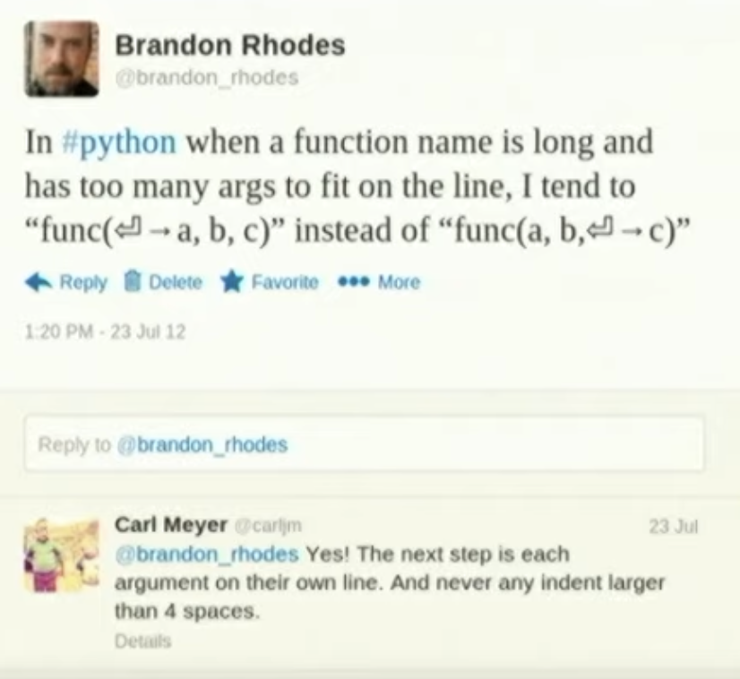

# Python Notes

## Variables

Python variables can't start with a number.

Variables can't start with a number, but can contain numbers.

Variables can't contain spaces, but can contain underscores.

Variables can't contain special characters, but can contain underscores.

They can't be Python keywords. Like 'list' or 'str' or 'for'.

Variables are case sensitive. 'a' is different from 'A'.
It's is dynamically typed. You don't need to specify the type of the variable.

Whole words should be separated by an underscore. Be verbose with your variable names.

`type()` is a function that returns the type of the variable.

`none` is a special type in Python. It's used to represent the absence of a value. It is the same as `null` in other languages.

```python
>>> x = None
>>> type(x)
>>> <class 'NoneType'>
```

The above is a snippet from the Python interpreter. The `>>>` is the prompt. The `x = None` is the command. The `type(x)` is the output. The `<class 'NoneType'>` is the type of the variable.

## Numbers

There are three types of numbers in Python. Integers, floating point numbers and complex numbers.

Integers are whole numbers. Floating point numbers are numbers with decimal points. Complex numbers are numbers with imaginary parts.

```python
>>> # Integers
>>> x = 4
>>> y = -3938
>>> z = 0
```

Just add a decimal point to make it a floating point number.

```python
>>> x = 5.0
>>> y = -3484.5
>>> z = 0.0
>>> z
0.0
>>>type(z)
<class 'float'>
```

Python also has complex numbers. Complex numbers are numbers with imaginary parts. The imaginary part is denoted by `j`.

```python
>>> x = 42j
>>> x
42j
>>> type(x)
<class 'complex'>
```

Here's a another check for the type of the variable.

```python
>>> type(y)
<class 'float'>
>>> type(1)
<class 'int'>
```

```python
>>> x = 5
>>> y = 3.0
>>> x + y
8.0
```

In this example, an integer and a floating point number are added. The result is a floating point number.

```python
>>> 6 / 2
3.0
>>>
```

Note that dividing by an integer returns a floating point number.

## Strings

Strings are sequences of characters. They are enclosed in single quotes or double quotes.

```python
>>> 'Hello'
'Hello'
>>> "Hello"
'Hello'
>>>
```

It's generally best practice to use double quotes. That way you can avoid escaping single quotes.

You can define a string with triple quotes. This is useful for multi-line strings.

```python
>>> long_string = """
... 12345
... abc
... """
>>> long_string
'\n12345\nabc\n'
```

There are several types of string formatting. The most common is the `format()` method.

Here is an example of an 'f-string'. It's a new way of formatting strings in Python 3.6.

```python
>>> name = "Nina"
>>> f"Hello, {name}"
'Hello, Nina'
```

```python
salutation = "Hello "
name = "Nina"
greeting = salutation + name
# The value of greeting will be "Hello Nina"
```

### Common mistakes

Not closing the quotes properly.

```python
>>> name = 'Nina"
  File "<stdin>", line 1
    name = 'Nina"
                 ^
SyntaxError: EOL while scanning string literal
```

If you try to concatenate a string and a number, you'll get an error.

```python
>>> "Hello, " + 3
Traceback (most recent call last):
  File "<stdin>", line 1, in <module>
TypeError: can only concatenate str (not "int") to str
```

### Practice

Use the `type()` function to check the type of the following variables.

```python
>>> x = 42
>>> y = 3 / 4
>>> z = int('7')
>>> a = float(5)
>>> name = "Nina"
```

Output:

```python
>>> type(x)
>>> <class 'int'>
>>> type(y)
>>> <class 'float'>
>>> type(a)
>>> <class 'float'>
>>> type(name)
>>> <class 'str'>
```

f-strings are the new way of formatting strings in Python and are recommended over the older methods.

```python
>>> name = 'Wanda'
>>> print(f"My name is {name} and I am a dog")
My name is Wanda and I am a dog
```

Here's a way to calculate the rent per day from the monthly rent.

```python
My name is Wanda and I am a dog
>>> rent = 5000
>>> per_day = rent / 30
>>> per_day
166.66666666666666
>>> print(per_day)
166.66666666666666
>>>
```

Here is the old way of formatting strings. It's not recommended.

```python
>>> name = 'Wanda'
>>> print("My name is %s and I am a dog" % name)
My name is Wanda and I am a dog
```

Two different ways to use print to print a string.

```python
# using a comma
>>> print("My name is", name)
My name is Wanda
# using an f-string
>>> print(f"My name is {name}.")
My name is Wanda.

```

```python
>>> print (f"My name is {name} and I pay ${ rent / 30} / day in rent")
My name is Bill the Programmer and I pay $166.66666666666666 / day in rent
```

Python has a few built-in functions to help you if you get stuck. `type()` tells you what an object’s type is, for example a string `(str)` or integer `(int)`. `dir()` returns a list of valid attributes for an object, so you can quickly see what variables an object has or what functions you can call on it. `help()` brings up helpful documentation on any object. You can also type `help()` on its own to bring an interactive help console.

Here's an example of using `dir()`.

```python
>>> dir(str)
['__add__', '__class__', '__contains__', '__delattr__', '__dir__', '__doc__', '__eq__', '__format__', '__ge__', '__getattribute__', '__getitem__', '__getnewargs__', '__gt__', '__hash__', '__init__', '__init_subclass__', '__iter__', '__le__', '__len__', '__lt__', '__mod__', '__mul__', '__ne__', '__new__', '__reduce__', '__reduce_ex__', '__repr__', '__rmod__', '__rmul__', '__setattr__', '__sizeof__', '__str__', '__subclasshook__', 'capitalize', 'casefold', 'center', 'count', 'encode', 'endswith', 'expandtabs', 'find', 'format', 'format_map', 'index', 'isalnum', 'isalpha', 'isascii', 'isdecimal', 'isdigit', 'isidentifier', 'islower', 'isnumeric', 'isprintable', 'isspace', 'istitle', 'isupper', 'join', 'ljust', 'lower', 'lstrip', 'maketrans', 'partition', 'removeprefix', 'removesuffix', 'replace', 'rfind', 'rindex', 'rjust', 'rpartition', 'rsplit', 'rstrip', 'split', 'splitlines', 'startswith', 'strip', 'swapcase', 'title', 'translate', 'upper', 'zfill']
```

It shows all the available methods for the string class.

Here's an example of using `dir()` on an integer.

```python
>>> dir(int)
['__abs__', '__add__', '__and__', '__bool__', '__ceil__', '__class__', '__delattr__', '__dir__', '__divmod__', '__doc__', '__eq__', '__float__', '__floor__', '__floordiv__', '__format__', '__ge__', '__getattribute__', '__getnewargs__', '__gt__', '__hash__', '__index__', '__init__', '__init_subclass__', '__int__', '__invert__', '__le__', '__lshift__', '__lt__', '__mod__', '__mul__', '__ne__', '__neg__', '__new__', '__or__', '__pos__', '__pow__', '__radd__', '__rand__', '__rdivmod__', '__reduce__', '__reduce_ex__', '__repr__', '__rfloordiv__', '__rlshift__', '__rmod__', '__rmul__', '__ror__', '__round__', '__rpow__', '__rrshift__', '__rshift__', '__rsub__', '__rtruediv__', '__rxor__', '__setattr__', '__sizeof__', '__str__', '__sub__', '__subclasshook__', '__truediv__', '__trunc__', '__xor__', 'as_integer_ratio', 'bit_length', 'conjugate', 'denominator', 'from_bytes', 'imag', 'numerator', 'real', 'to_bytes']
```

Here's an example of using `help()`.

```python
>>> help(str)
Help on class str in module builtins:
class str(object)
 |  str(object='') -> str
 |  str(bytes_or_buffer[, encoding[, errors]]) -> str
 |
 |  Create a new string object from the given object. If encoding or
 |  errors is specified, then the object must expose a data buffer
 |  that will be decoded using the given encoding and error handler.
 |  Otherwise, returns the result of object.__str__() (if defined)
 |  or repr(object).
 |  encoding defaults to sys.getdefaultencoding().
 |  errors defaults to 'strict'.
 |
 |  Methods defined here:
 |
 |  __add__(self, value, /)
 |      Return self+value.
 |
 |  __contains__(self, key, /)
 |      Return key in self.
 |
 |  __eq__(self, value, /)
 |      Return self==value.
 |
 |  __format__(self, format_spec, /)
 |      Return a formatted version of the string as described by format_spec.
```

And so on.

Using help on a specific method.

```python
>>> help(int.real)
Help on getset descriptor builtins.int.real:

real
    the real part of a complex number
(END)
```

## Functions

Functions are blocks of code that can be reused. They are defined with the `def` keyword followed by a space. Then the name of the function. Then a set of parentheses. Then a colon. Then the body of the function. The body of the function is indented.

There are no brackets, indentation is used. The indentation is usually 4 spaces. Tab will give you four spaces in the Python interpreter.

Hit enter twice to exit the function.

```python
>>> def foo():
...     print("Hello guys!")
...
>>> foo()
Hello guys!
>>>

```

This function returns nothing, just uses the
`print()` function to print a string.

```python
>>> def meaning_of_life():
...     return 42
...
>>> meaning_of_life()
42
```

Here we assign the evaluated result of a function to a variable.

```python
>>> called_foo = foo()
Hello guys!
>>> x = meaning_of_life()
>>> x
42
```

And we can pass arguments to functions.

```python
>>> def add_numbers(x, y):
...     return x + y
...
>>> add_numbers(3, 5)
8
>>> a = 1
>>> b = 5
>>> add_numbers(a, b)
6
```

If we don't use the proper syntax, we'll get an error:

```python
>>> def oops:
  File "<stdin>", line 1
    def oops:
            ^
SyntaxError: invalid syntax
```

The return statement is optional, if you don't use it, the function will return `None`.

```python
>>> def greeting(name):
...     greeting = "Hello "
...     return greeting + name
...
>>> greeting("Bill")
'Hello Bill'
```

You can have a return statement that has no value.

If we return nothing from a function, and then check the
`type` on the output, then we will see that it is `None`.

```python
>>> def foo():
...     x = 5
...     return
...
>>> x = foo()
>>> type(x)
<class 'NoneType'>
```

It will return from anywhere within the function.
You will get an error of unreachable code if you try to return from a function after a return statement.

### Arguments

Arguments are the values that are passed to a function. They are defined in the parentheses after the function name.

```python
>>> add_numbers(3,5)
8
>>> add_numbers(3)
Traceback (most recent call last):
  File "<stdin>", line 1, in <module>
TypeError: add_numbers() missing 1 required positional argument: 'y'
```

If you don't include a required argument, you'll get an error. In this case it's a TypeError.

Python also has keyword arguments with default values. These are optional arguments.

```python
>>> def say_greeting(greeting, name):
...     print(f"{greeting}, {name}")
...
>>> say_greeting("Hello", "Dr. Steve")
Hello, Dr. Steve
>>>
```

### Default values

Default values always come last.

Here's an example of using a default value.

```python
>>> def say_greeting(name, greeting="Hello"):
...     print(f"{greeting}, {name}")
...
>>> say_greeting("Dr. Steve")
Hello, Dr. Steve

# Changing the default value
>>> say_greeting("Dr. Steve", "Bonjour")
Bonjour, Dr. Steve
```

Here we'll use the program written before, with default values assigned to the arguments.

```python
>>> def create_query(language="Javascript", num_stars=50, sort="desc"):
...     return f"language: {language}, {num_stars} {sort}"
...
>>> create_query()
'language: Javascript, 50 desc'

```

When we call the function without any arguments, it will use the default values.

```python
>>> create_query(language="Python")
'language: Python, 50 desc'
```

Above we add Python as the language, and it uses Python as the default for the language parameter but it will still use the default values for the other arguments.

```python
>>> create_query(language="Python", sort=100, num_stars=1)
'language: Python, 1 100'
```

Above we change the sort and num_stars arguments.

```python

```

### Empty Default Lists

You never want to use mutable objects as default values. Mutable objects are objects that can be changed. Lists are mutable objects. If you use a list as a default value, it will be shared between all calls to the function.

```python
>>> def foo(a, b=[]):
...     b.append(a)
...     print("B is: ", b)
...
>>> foo(5)
B is:  [5]
>>> foo(6)
B is:  [5, 6]
```

6 is added to the list because it is passed in on the second invocation of the function. The list is shared between the two calls to the function.

Note: you want to name your variables with as much meaning as possible. `a` and `b` are not good variable names. Make them as descriptive as possible.

Check out this talk by Brandon Rhodes on [The Naming of Ducks: Where Dynamic Types Meet Smart Conventions](https://www.youtube.com/watch?v=YklKUuDpX5c).



### Function Scope

Variables defined inside a function are not available outside the function. This is called scope.

> Function scope in Python and JavaScript has some similarities, but there are also important differences:
>
> **Python Function Scope:**
>
> In Python, a variable defined within a function is considered to have function scope. This means that the variable is accessible only within the function in which it is defined and any nested functions.

```python
def my_function():
    x = 10  # Variable x has function scope
    print(x)

my_function()
# print(x)  # This will result in an error because x is not accessible here
```

> **JavaScript Function Scope:**
>
> In JavaScript, until the introduction of the `let` and `const` keywords, variables declared within a function were considered to have function scope. This means they were accessible within the function they were defined in and any nested functions. However, this could sometimes lead to unexpected behavior known as "hoisting," where variables declared with `var` are brought to the top of their function or global scope.

```javascript
function myFunction() {
  var y = 20; // Variable y has function scope
  console.log(y);
}

myFunction();
// console.log(y);  // This will result in an error or undefined
```

> **Block Scope:**

> With the introduction of the `let` and `const` keywords in JavaScript, you can now also have block-scoped variables. This means that a variable declared with `let` or `const` is accessible only within the block of code (within curly braces) where it's defined.

```javascript
function myFunction() {
  if (true) {
    let z = 30; // Variable z has block scope
    console.log(z);
  }
  // console.log(z);  // This will result in an error because z is not accessible here
}
```

> **Arrow Functions and Scope:**
>
> In JavaScript, arrow functions introduced in ES6 have a unique behavior with regard to scope. Arrow functions do not have their own `this` context and inherit the `this` value from the enclosing function or context.

```javascript
function outerFunction() {
  var self = this; // Store the value of this in a variable
  setTimeout(function () {
    console.log(self); // This will print the value of this from outerFunction
  }, 1000);
}

outerFunction();
```

> In Python, arrow functions are not present, so the scope and `this` context behavior is different.

> In summary, while both Python and JavaScript have function scope, JavaScript has some nuances related to hoisting, the introduction of block scope with `let` and `const`, and the behavior of arrow functions. Understanding these differences is crucial for writing clean and error-free code in both languages.

See in this example that `account` is not available outside the function.

```python
>>> def twitter_info():
...     account = "elona_musc"
...     print(f"Account inside the function is {account}")
...
>>> twitter_info()
Account inside the function is elona_musc
>>> account
Traceback (most recent call last):
  File "<stdin>", line 1, in <module>
NameError: name 'account' is not defined
```

It throws an error when called outside the funtion.

See in this example where we try to change the name
declared outside the function.

```python
>>> name = "Reza"
>>> def try_change_name():
...     name = "Wanda"
...     print(f"Name inside of function: {name}")
...
>>> try_change_name()
Name inside of function: Wanda
>>> name
'Reza'
```

The name is not changed outside the function, but when we call the function, it uses the `name` variable defined inside of the function.

When we use an f-string to see what the value of `name` is outside of the function, we see that it is still `Reza`.

```python
>>> f"Name outside of the function: {name}"
'Name outside of the function: Reza'
```

We don't really want to follow this pattern, so in general in our production Python programs, we don't want too many variables floating around outside of functions or defined scope. Probably better to use a constant.

** Don't do this: **

```python
>>> def foo(a, b=[]):
...     b.append(a)
...     print(b)
...
>>> foo(1)
[1]
>>> foo(5)
[1, 5]
```

This will introduce a bug in your program. Instead, do this:

```python
>>> def foo(a, b=None):
...     if b is None:
...             b = []
...     b.append(a)
...     print(b)
...
>>> foo(1)
[1]
>>> foo(5)
[5]
```

Use control flow to check if the argument is `None`. If it is, then assign an empty list to it.

### Practice

```python
>>> def add_numbers(x, y):
...     return x + y
...
>>> first_num=15
>>> second_num=25
>>> print(f"The sum of {first_num} and {second_num} is {add_numbers(first_num, second_num)}")
The sum of 15 and 25 is 40
```

Here's an indentation error:

```python
>>> def add_numbers(x, y):
... return x + y
  File "<stdin>", line 2
    return x + y
    ^
IndentationError: expected an indented block
```
